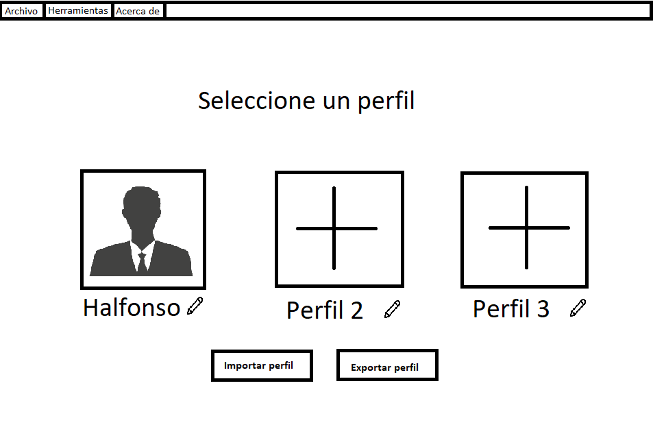
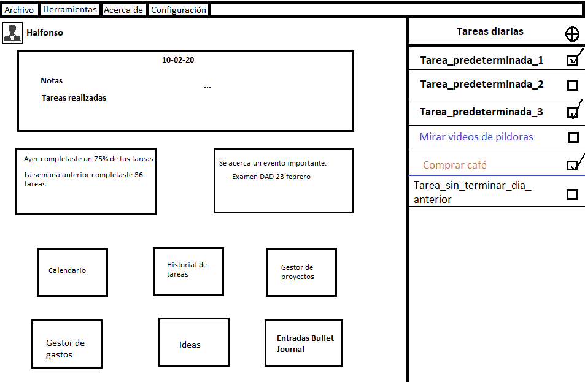
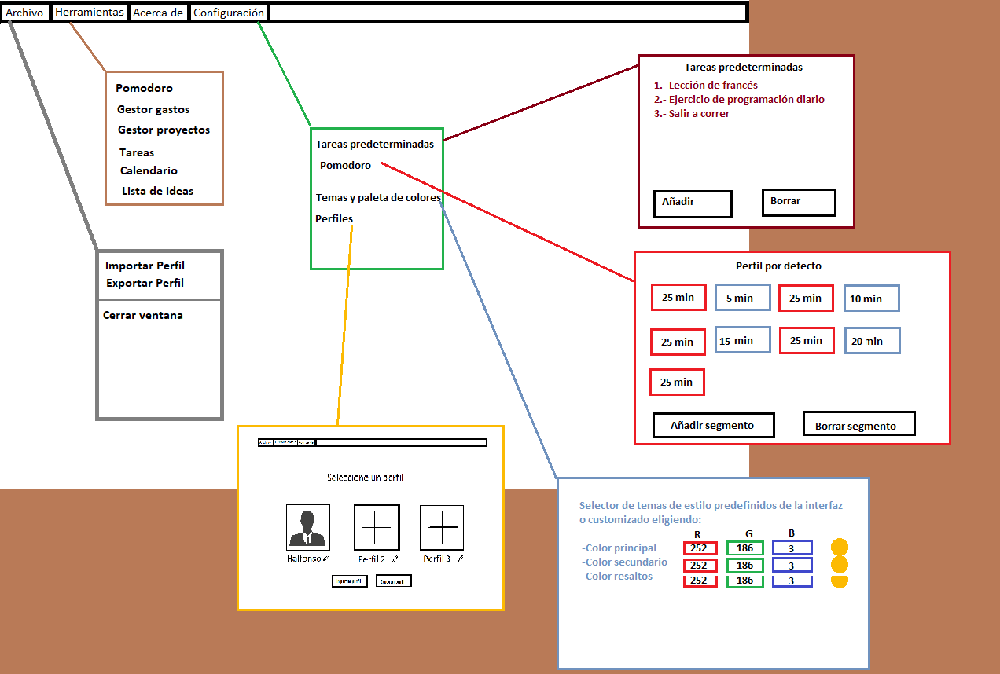
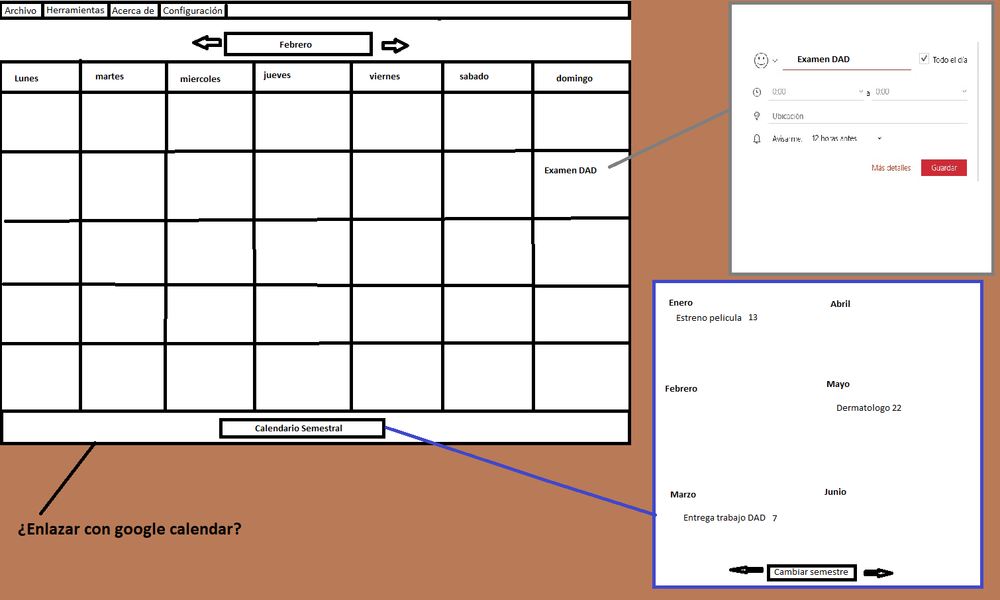
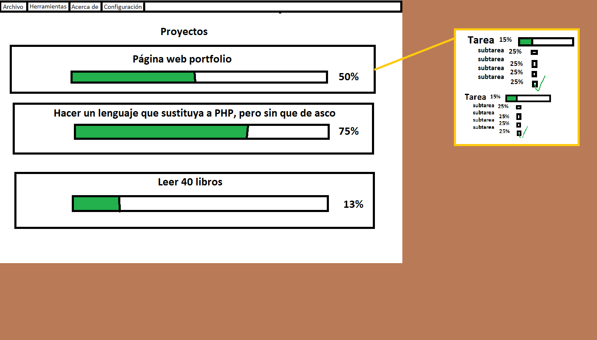
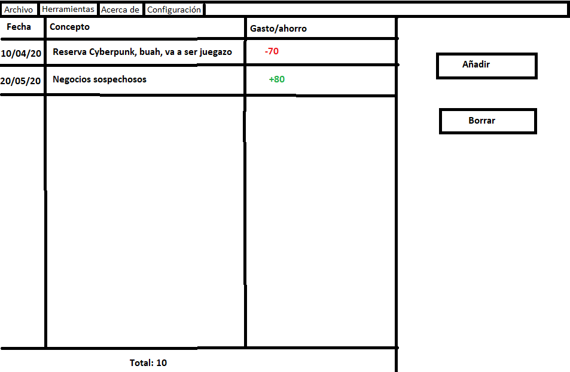

Color browser diseño:

https://coolors.co/

JFoenix

https://github.com/jfoenixadmin/JFoenix

BootstrapFX 

https://github.com/kordamp/bootstrapfx

Animaciones javaFX

https://youtu.be/6rLyTUzqscQ

Ejemplo FontAwesomeFX

https://github.com/Jerady/fontawesomefx-examples

Como usar JFoenix

https://www.youtube.com/watch?v=uNsy1b_BZ6o

Calendario-CalendarFx

https://github.com/dlsc-software-consulting-gmbh/CalendarFX

Prototipo de inferfaz 

Bosquejos de la interfaz

